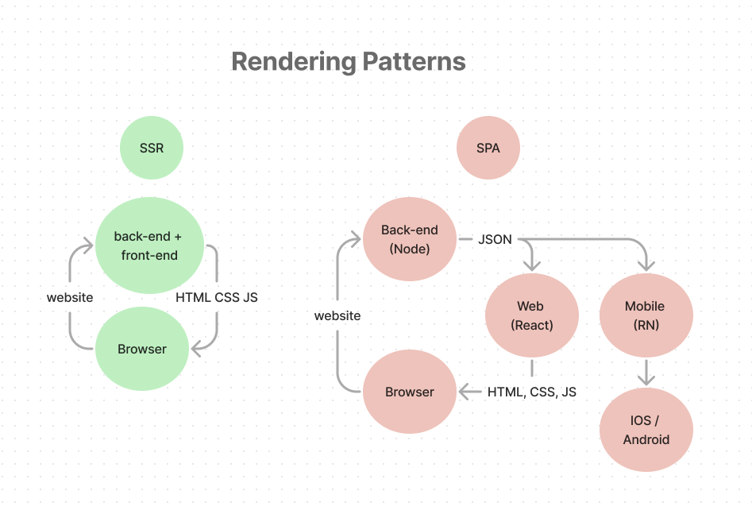

# :butterfly: Fundamentos de React!

  

  

  

  

## :open_file_folder: Sobre o Projeto: Fundamentos do React

### O que é o React?

1. React é uma biblioteca JavaScript, útil para construir interfaces, primeiramente para aplicações single-pages, SPA. É utilizado para lidar com a camada view na web e mobile. React permite desenhar views simples para cada estado em sua aplicação, e atualizar de maneira eficiente os componentes necessários quando os dados atualizarem.

2. React possui componentes, os quais são reutilizáveis e podem gerenciar seus próprios estados. Então, em aplicações grandes, partes individuais podem ser atualizadas sem necessidade de recarregar a página inteira. Isso permite mais eficiência da aplicação, além de melhorar a experiência do usuário.

3. React é apenas uma biblioteca, o que significa que não é um completo framework. Então, React pode ser utilizado com outras bibliotecas como Redux para gerenciamento de estados e React Router para roteamento.

### O que é SPA?

➜ SPA significa Single Page Application, ou Aplicação de Página Única. É uma abordagem dinâmica para construção de aplicações web ou websites, onde a página é reescrita conforme ações do usuário, em vez de carregar páginas inteiras. SPA carrega todo o código HTML, JavaScript, e CSS necessários, sendo igualmente recebidos pelo browser, com o carregamento dos recursos necessários iniciais, que são dinamicamente atualizados e adicionados novos recursos e páginas conforme as necessidades de navegação, normalmente em resposta às interações do usuário. O objetivo é fazer transições mais rápidas que fazem o website ser mais um app nativo, semelhante os de desktop.

➜ Os SPAs normalmente interagem com **server-side APIs** para realizar o `fetch` e enviar dados, pontos importantes da natureza dinâmica dos SPAs. Além disso, enquanto os SPAs podem melhorar a experiência tanto do usuário como do desenvolvedor, traz também uma série de desafios, como otimização SEO e carregamento inicial.

➜ As Single Page Applications (SPAs) são geralmente consideradas "client-side" porque a maior parte do processamento e renderização é feita no navegador do cliente, em vez de no servidor. Isso é diferente das aplicações "server-rendered", onde cada nova página ou conteúdo é gerado e enviado pelo servidor cada vez que o usuário solicita uma nova página ou faz uma ação que requer uma atualização da página.

### :eyes: Curiosidades:

➜ "Server-side" e "server-rendered" são relacionados, mas são conceitos distintos. "Server-side" refere-se a qualquer operação que é performada no servidor em uma aplicação "client-server". Isso inclui processamento de dados, autenticação de usuário, interações com o banco de dados, e mais. Por outro lado, o "server-rendered" refere-se especialmente ao processo onde o servidor gera as páginas HTML e envia elas ao cliente. Este é um contraste com o "client-side-rendering", onde as páginas HTML são geradas no browser do cliente. Ou seja, em aplicações "server-redered", o servidor trabalha mais, enquanto no "client-side", como os SPAs, o browser do cliente faz a maior parte do trabalho.

➜ Inicialmente, os sites da web iniciais, eram principalmente "server-rendered". Cada vez que o usuário final clicava em um link para ir para uma nova página, o servidor tinha que gerar todo o HTML para essa página e enviá-lo para o seu navegador. Isso poderia ser lento e ineficiente. Assim, linguagens de servidor, como **PHP**, **Ruby** e **Python**, foram introduzidos, permitindo gerar conteúdo de maneira dinâmica baseado em interações com bancos de dados. O conceito de SPA representa uma mudança em como pensar sobre desenvolvimento web. Ao invés de depender do servidor entregar os arquivos HTML, os SPAs usam o JavaScript para dinamicamente atualizar a página atual em resposta à interação do usuário, conduzindo para uma experiência melhor do usuário.

➜ O conceito de SPA iniciou amplamente em volta de 2003, quando AJAX começou a tornar-se popular, permitindo páginas web serem carregadas de maneira assíncrona e atualizadas. Entretanto, não foi antes de 2010, onde houve o aumento emergente de frameworks como AngularJS, que as SPAs começaram a ganhar notoriedade pela comunidade de profissionais. AngularJS, desenvolvido pela Google, foi um dos principais frameworks desenhados especificamente para construir SPAs, mas o conceito de SPA já existia antes mesmo do AngularJS. O AJAX (Asynchronous JavaScript and XML) foi a chave fundamental que fez com que as SPAs fossem posíveis, como permitir atualizar dados para serem carregadores em background sem requerer que a página recarrega-se.

➜ Em uma SPA, após o carregamento inicial da página, toda a interação com o servidor ocorre por meio de chamadas AJAX. Essas chamadas AJAX retornam dados, não marcação. O JavaScript do lado do cliente, que é carregado com a página inicial, recebe esses dados e os utiliza para atualizar dinamicamente a página da web. Isso pode levar a uma experiência do usuário mais fluída, já que apenas as partes da página que precisam mudar são atualizadas, em vez de ter que recarregar a página inteira.

➜ Diferente do conceito de SPA, no início da web, os websites eram apenas estáticos, como landing pages e hotsites. Estes eram apenas arquivos HTML, CSS até chegar na Web 2.0 com acesso dinâmico, a banco de dados, com linguagens como PHP, Ruby, Phyton, Java.

➜ Hoje em dia, há uma variedade de bibliotecas e frameworks, como React, Vue.js, que também suportam o desenvolvimento de SPAs. Cada um possui pontos fortes e fracos, onde a melhor escolha depende das especificações e necessidades de cada projeto.

➜ Em desenvolvimento web moderno, SPAs são normalmente utilizados com arquitetura para JSON. Isso permite que o backend, como Node.js, envie e receba dados em formato JSON. Estes dados podem ser utilizados não apenas para clientes web, mas também outros tipos de clientes, como os de mobile. Isso é parte de tornar as APIs mais flexíveis e poderosas.
